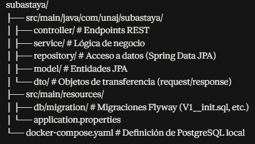

Trabajo Práctico de la materia Proyecto de Software - Ing. en Informática.

## Integrantes

- Destefani Franco
- Santillan Facundo

## Stack Tecnológico

- **Lenguaje:** Java 17
- **Framework:** Spring Boot 4.1.1 (Spring Framework 7)
- **Persistencia:** Spring Data JPA / Hibernate
- **Base de datos:** PostgreSQL 16
- **Migraciones:** Flyway (esquema code-first)
- **Comunicación en tiempo real:** WebSockets (Spring WebSocket)
- **Documentación de API:** Springdoc OpenAPI (Swagger UI)
- **Build:** Maven
- **Contenedores:** Docker Compose (para levantar PostgreSQL localmente)

## Decisiones de arquitectura

- **Optimistic Locking:** las entidades `Subasta` y `Billetera` incluyen un
  campo `version` para evitar condiciones de carrera en operaciones
  concurrentes de puja y actualización de saldo. Ante conflicto, la API
  responde `409 Conflict` en lugar de un error genérico `500`.
- **Transaccionalidad (ACID):** las operaciones críticas (congelar/liberar
  saldo, liquidación final de subasta) se ejecutan dentro de bloques
  `@Transactional`, garantizando rollback completo ante cualquier fallo.
- **Endpoints RESTful:** rutas basadas exclusivamente en sustantivos
  plurales y jerarquías de recursos (ej. `GET /api/v1/subastas/{id}/pujas`),
  sin verbos en la URL.
- **Tiempo real - WebSocket + STOMP:** para evitar polling. Endpoint `ws://localhost:8080/ws`. Handshake HTTP con `101 Switching Protocols`. Sobre el tubo TCP se usa STOMP:
    - Cliente pide estado inicial por `/app/subastas/{id}` -> recibe `ESTADO_ACTUAL`.
    - Cliente se suscribe a `/topic/subastas/{id}` -> recibe broadcast de `NUEVA_PUJA`, `EXTENSION_TIEMPO`, `FINALIZADA`/`DESIERTA`.
    - Flujo: `POST /api/v1/subastas/{id}/pujas` -> `SubastaNotificador` -> `SimpMessagingTemplate.convertAndSend("/topic/...")`.
    - Tests en `SubastaWebSocketTest.java` con `WebSocketStompClient` real y `BlockingQueue`.
- **Background Worker:** un proceso `@Scheduled` verifica cada 60s las
  subastas vencidas, las liquida o marca `DESIERTA`, y registra el cierre
  en `auditoria_log` (ver sección dedicada más abajo).
- **Auditoría:** los cambios críticos (cambios de estado, extensiones por
  anti-sniping, pujas rechazadas, acreditaciones manuales) quedan
  registrados de forma inmutable en `auditoria_log` (ver sección dedicada).


## Requisitos previos

- JDK 17 o superior
- Docker Desktop
- Un IDE compatible con Maven (recomendado: IntelliJ IDEA)
- Git
- Node.js 18+ (solo para el frontend, paso 5) — trae `corepack` incluido

No es necesario instalar PostgreSQL manualmente: se levanta con Docker.
Tampoco hace falta instalar `pnpm` por separado: corriendo
`corepack enable` una sola vez por máquina, el comando `pnpm` (usado en el
paso 5) queda disponible sin instalación aparte.

## Cómo levantar el proyecto

1. **Clonar el repositorio**
```bash
   git clone https://github.com/TU_USUARIO/subastaya-tp.git
   cd subastaya-tp/backend
```

2. **Levantar la base de datos con Docker**
```bash
   docker compose up -d
```
Verificar que el contenedor esté sano:
```bash
   docker compose ps
```
Debería mostrar `subastaya-db` con estado `healthy`.

3. **Configurar el Run en el IDE**

   En IntelliJ: `Run → Edit Configurations → Add new → Application`
    - Main class: `com.unaj.subastaya.SubastayaApplication`
    - Module: `backend`
    - JDK: 17 (o superior instalado)

   **Importante:** si tu sistema operativo usa una zona horaria que
   PostgreSQL no reconoce (error típico:
   `FATAL: invalid value for parameter "TimeZone"`), agregar en
   **VM options**:

-Duser.timezone=America/Argentina/Buenos_Aires

(ajustar al identificador IANA correspondiente a tu ubicación si no
estás en Argentina).

4. **Correr la aplicación**

   La API queda disponible en `http://localhost:8080`.
   Documentación interactiva (Swagger UI) en:
   `http://localhost:8080/swagger-ui.html`

5. **Levantar el frontend** (opcional, para probar el login end-to-end)
```bash
   corepack enable   # una sola vez por máquina, si no tenés pnpm instalado
   cd ../frontend
   pnpm install
   pnpm dev
```
   Queda disponible en `http://localhost:5173`. En desarrollo, Vite proxea
   `/api/*` hacia `http://localhost:8080` (ver `frontend/vite.config.js`),
   así no hace falta configurar CORS.

## Estructura del proyecto

subastaya-tp/
├── backend/
│ ├── src/main/java/com/unaj/subastaya/
│ │ ├── controller/ # Endpoints REST
│ │ ├── service/ # Lógica de negocio
│ │ ├── repository/ # Acceso a datos (Spring Data JPA)
│ │ ├── model/ # Entidades JPA
│ │ └── dto/ # Objetos de transferencia (request/response)
│ ├── src/main/resources/
│ │ ├── db/migration/ # Migraciones Flyway (V1__init.sql, etc.)
│ │ └── application.properties
│ └── docker-compose.yaml # Definición de PostgreSQL local
└── frontend/ # Vite + React
  └── src/
    ├── pages/ # Pantallas (ej. LoginPage)
    └── api/ # Clientes fetch hacia el backend


_(Se irá actualizando a medida que se agreguen módulos.)_

## Prueba de Concurrencia (Optimistic Locking)

Para probar que el `version` de `Billetera` evita que dos pujas idénticas se
procesen dos veces (requisito 4.1 de la consigna), se envían dos peticiones
`POST` idénticas al mismo instante contra la misma subasta y comprador. Una
debe responder `200 OK` y la otra `409 Conflict`.

Requiere tener la app corriendo con el seed data (`V2__seed.sql`) aplicado.
Ejemplo contra la subasta "Notebook Gamer RTX 4070" (id `1`) y el comprador
`comprador2@test.com` (id `3`), ajustando el `monto` a uno válido según el
estado actual de la subasta:

## Background Worker de liquidación

Un proceso `@Scheduled` (`SubastaLiquidacionWorker`) corre cada 60 segundos,
busca subastas `ACTIVA` con `fechaFin` vencida y las cierra:

- **Con ganador:** transfiere el saldo retenido del comprador al vendedor
  (`BilleteraService.pagar` / `cobrar`), registra `PAGO`/`COBRO` en el Ledger
  y marca la subasta `FINALIZADA`.
- **Sin pujas:** marca la subasta `DESIERTA`.

Todo el cierre de una subasta ocurre en una única transacción: si falla el
débito, no se acredita al vendedor ni se cambia el estado, y la subasta se
reprocesa en la corrida siguiente. Un error en una subasta no afecta a las
demás. Cada cierre queda registrado en `auditoria_log` con acción
`CIERRE_WORKER` y `usuario_id = null` (acción del sistema), y se difunde por
WebSocket (`TipoEvento.FINALIZADA` / `DESIERTA`).

En tests, el disparo automático se posterga con
`-Dsubastaya.worker.initial-delay-ms=3600000` (argLine de Surefire) para no
consumir el seed; los tests invocan `cerrarSubastasVencidas()` manualmente.
Ver `SubastaLiquidacionWorkerTest`.

```bash
BODY='{"compradorId":3,"monto":48000}'

curl -s -o resp1.txt -w "%{http_code}" -X POST \
  http://localhost:8080/api/v1/subastas/1/pujas \
  -H "Content-Type: application/json" -d "$BODY" > status1.txt &

curl -s -o resp2.txt -w "%{http_code}" -X POST \
  http://localhost:8080/api/v1/subastas/1/pujas \
  -H "Content-Type: application/json" -d "$BODY" > status2.txt &

wait
echo "STATUS 1: $(cat status1.txt)"; cat resp1.txt
echo "STATUS 2: $(cat status2.txt)"; cat resp2.txt
```

Salida real capturada en una corrida local:

```
STATUS 1: 200
{"id":7,"subastaId":1,"compradorId":3,"compradorNombre":"Comprador Dos","monto":48000,"fechaPuja":"2026-08-30T21:47:37.8931072","fechaFinSubasta":"2026-08-30T22:08:20.989266","extendidoPorAntiSniping":false}
STATUS 2: 409
{"timestamp":"2026-08-30T21:47:37.9016031","status":409,"mensaje":"El recurso fue modificado por otra operación concurrente, reintentá la solicitud","errores":null}
```

La segunda petición falla porque, al intentar congelar el saldo del mismo
comprador, Hibernate detecta que el campo `version` de su `Billetera` ya fue
incrementado por la primera transacción y lanza
`ObjectOptimisticLockingFailureException`, que el `GlobalExceptionHandler`
traduce a `409 Conflict` en vez de un `500` genérico. El intento rechazado
además queda registrado en `auditoria_log` con acción `PUJA_RECHAZADA`.

## Auditoría de eventos y trazabilidad

Tabla append-only `auditoria_log`. Acciones de usuario llevan `usuario_id`;
las del Worker/sistema van con `usuario_id = null`. El rechazo de una puja
usa `REQUIRES_NEW` para que el registro sobreviva el rollback.

| Acción | Entidad | Cuándo |
|---|---|---|
| `CIERRE_WORKER` | `SUBASTA` | Worker pasa a `FINALIZADA` o `DESIERTA` |
| `EXTENSION_TIEMPO` | `SUBASTA` | Anti-sniping extiende `fecha_fin` |
| `PUJA_RECHAZADA` | `SUBASTA` | Validación de negocio o `409` de concurrencia |
| `ACREDITACION_MANUAL` | `BILLETERA` | Depósito de saldo |

Endpoints:

```bash
GET  /api/v1/auditoria?entidad=SUBASTA&entidadId=4
GET  /api/v1/billeteras/{usuarioId}
POST /api/v1/billeteras/{usuarioId}/depositos
```

El `POST` de depósito espera `{ "monto": 15000 }` y escribe `DEPOSITO` en el
Ledger más `ACREDITACION_MANUAL` en la misma transacción.

## Autenticación (Login)

Validación simple de credenciales — todavía no hay sesión ni token (no se
agregó Spring Security completo, solo `spring-security-crypto` para poder
hashear/verificar con BCrypt). El frontend guarda la respuesta en
`localStorage` y la reutiliza donde haga falta (billetera, pujas), igual que
ya se hacía pasando `compradorId` explícito en `PujaRequest`.

```
POST /api/v1/auth/login
{ "email": "comprador1@test.com", "password": "Password123!" }
```

- `200 OK` → `{ "usuarioId": 2, "nombre": "Comprador Uno", "email": "comprador1@test.com" }`
- `401 Unauthorized` → email inexistente o contraseña incorrecta (mismo
  mensaje genérico en ambos casos, para no filtrar cuál de los dos falló)
- `400 Bad Request` → campos vacíos o email con formato inválido

Contraseña de prueba para los 4 usuarios semilla: **`Password123!`** (hash
BCrypt real cargado por `V4__seed_passwords_bcrypt.sql` — los
`password_hash` de `V2__seed.sql` eran strings inventados, nunca hubieran
servido para autenticar).

Frontend: `frontend/src/pages/LoginPage.jsx` consume este endpoint vía
`frontend/src/api/authApi.js`. En desarrollo, Vite proxea `/api/*` hacia
`http://localhost:8080` (`frontend/vite.config.js`), así no hace falta
configurar CORS. Para probarlo end-to-end: levantar el backend
(`./mvnw spring-boot:run`), y en otra terminal `cd frontend && pnpm install && pnpm dev`.

## Convenciones de trabajo

- Ramas de trabajo: `feature/nombre-de-la-funcionalidad`
- No se trabaja directo sobre `main`: se integra vía Pull Request
- Commits descriptivos en español o inglés, consistente entre ambos

## Estado actual del TP

- [x] Setup del proyecto (Spring Boot + PostgreSQL + Docker)
- [x] Modelado de entidades JPA y primera migración
- [x] Lógica de escrow atómico
- [x] Regla anti-sniping
- [x] WebSockets - sala de subastas en vivo
- [x] Background Worker de liquidación
- [x] Auditoría de eventos (cierre Worker, anti-sniping, pujas rechazadas, acreditaciones manuales)
- [x] Autenticación básica (login, sin sesión/token todavía)
- [ ] Documentación Swagger completa.
